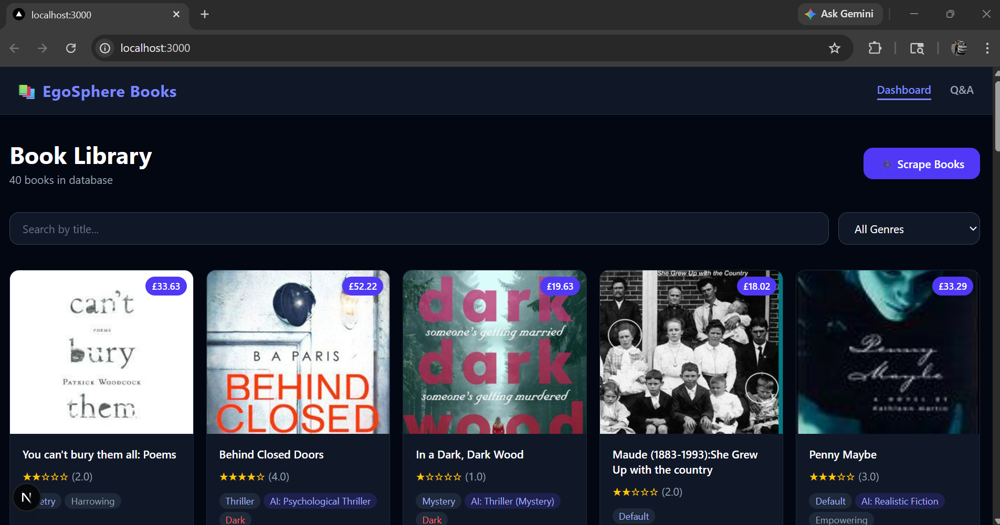
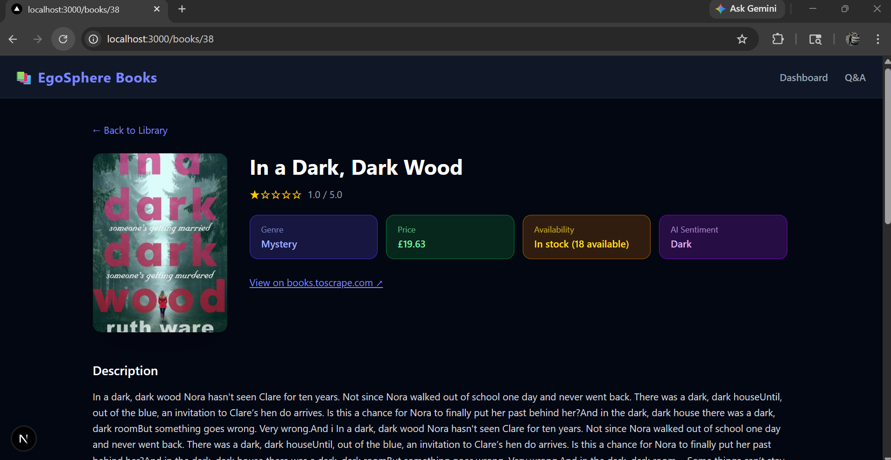
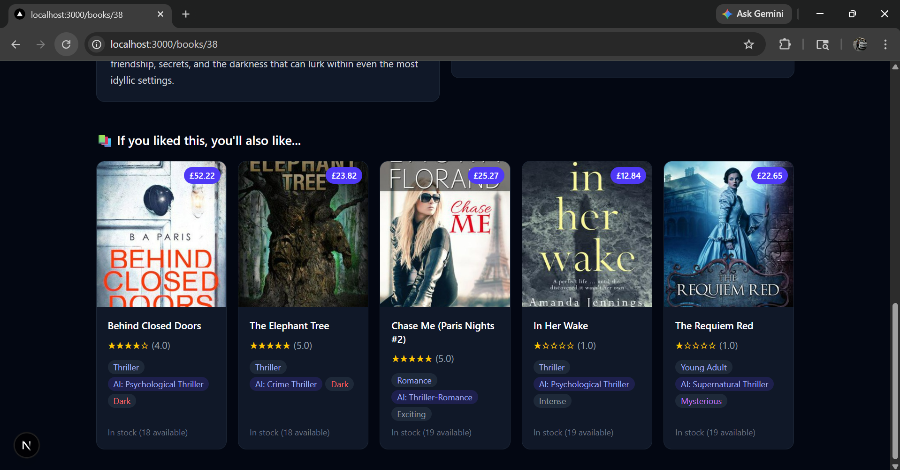
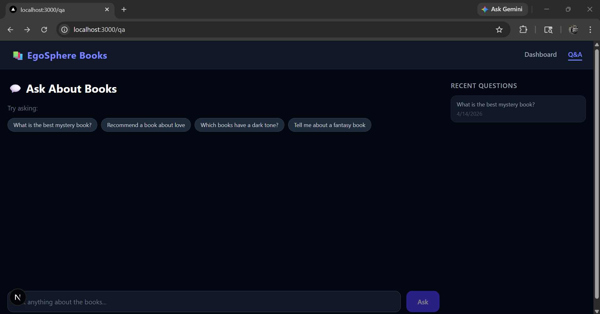

# EgoSphere Books — AI-Powered Book Insight System

A full-stack web application that scrapes books from the web, generates AI-powered insights, and supports intelligent question-answering using a RAG (Retrieval-Augmented Generation) pipeline.

---

## Screenshots

| Dashboard | Book Detail | Q&A Interface | Scrape Modal |
|-----------|-------------|---------------|---------------|
|  |  |  |  |

---

## Tech Stack

| Layer | Technology |
|-------|-----------|
| Backend | Django REST Framework (Python) |
| Database | MySQL (metadata) + ChromaDB (vectors) |
| Embeddings | Sentence Transformers — `all-MiniLM-L6-v2` |
| AI / LLM | LM Studio (local) — Mistral 7B Instruct |
| Scraping | Selenium + WebDriver Manager |
| Frontend | Next.js + Tailwind CSS |

---

## Features

- Multi-page Selenium scraping from books.toscrape.com
- AI Summary, Genre Classification, Sentiment Analysis via LM Studio
- Full RAG pipeline with ChromaDB vector search + source citations
- Response caching — avoids repeated LLM calls for same question
- Smart chunking with overlapping windows
- Recommendation engine based on genre similarity
- Q&A history saved and displayed
- Responsive Next.js + Tailwind CSS frontend
- Search and filter by genre on dashboard

---

## Project Structure

```
egosphere-books/
├── backend/
│   ├── config/             # Django settings, urls, wsgi
│   ├── books/              # Models, views, serializers, urls
│   ├── ai/
│   │   ├── embeddings.py   # ChromaDB + Sentence Transformers
│   │   ├── insights.py     # Summary, Genre, Sentiment via LM Studio
│   │   └── rag.py          # Full RAG pipeline
│   ├── scraper/
│   │   └── scrape_books.py # Selenium scraper
│   ├── vector_store/       # ChromaDB persistence (auto-created)
│   ├── manage.py
│   ├── requirements.txt
│   └── .env                # Environment variables (not committed)
└── frontend/
    ├── pages/
    │   ├── index.js         # Dashboard / Book listing
    │   ├── qa.js            # Q&A interface
    │   └── books/[id].js    # Book detail page
    ├── components/
    │   ├── Navbar.js
    │   ├── BookCard.js
    │   └── ScrapeModal.js
    ├── lib/
    │   └── api.js           # Axios API calls
    └── styles/
        └── globals.css
```

---

## Setup Instructions

### Prerequisites

Make sure you have the following installed:
- Python 3.10+
- Node.js 18+
- MySQL Server
- Google Chrome browser
- [LM Studio](https://lmstudio.ai/) with Mistral 7B loaded

---

### Step 1 — MySQL Setup

Open MySQL and run:
```sql
CREATE DATABASE egosphere_books CHARACTER SET utf8mb4 COLLATE utf8mb4_unicode_ci;
```

---

### Step 2 — LM Studio Setup

1. Download and install [LM Studio](https://lmstudio.ai/)
2. Open LM Studio → Search tab → search **Mistral 7B Instruct** → download `Q4_K_M` version
3. Go to **Local Server** tab → select the model → click **Start Server**
4. Server runs at `http://localhost:1234`
5. Note the model ID shown (e.g. `mistralai/mistral-7b-instruct-v0.3`)

---

### Step 3 — Backend Setup

```bash
cd backend

# Create and activate virtual environment
python -m venv venv
venv\Scripts\activate        # Windows
# source venv/bin/activate   # Mac/Linux

# Install dependencies
pip install -r requirements.txt
```

Create a `.env` file inside the `backend/` folder:
```env
DEBUG=True
SECRET_KEY=your-secret-key-here
DB_NAME=egosphere_books
DB_USER=root
DB_PASSWORD=your_mysql_password
DB_HOST=localhost
DB_PORT=3306
LM_STUDIO_BASE_URL=http://localhost:1234/v1
LM_STUDIO_MODEL=mistralai/mistral-7b-instruct-v0.3
CHROMA_PERSIST_DIR=./vector_store
```

```bash
# Run migrations
python manage.py makemigrations books
python manage.py migrate

# Start backend server
python manage.py runserver
```

Backend runs at: **http://localhost:8000**

---

### Step 4 — Frontend Setup

```bash
cd frontend
npm install
npm run dev
```

Frontend runs at: **http://localhost:3000**

---

### Step 5 — Scrape Books

Option A — Via the UI:
1. Go to http://localhost:3000
2. Click **Scrape Books**
3. Set number of pages (5 recommended)
4. Click **Start Scraping**

Option B — Via API:
```bash
curl -X POST http://localhost:8000/api/books/scrape/ \
  -H "Content-Type: application/json" \
  -d '{"num_pages": 5}'
```

---

### Step 6 — Generate AI Insights

After scraping, run this to generate AI insights for all books:
```bash
python -c "
import django, os
os.environ.setdefault('DJANGO_SETTINGS_MODULE', 'config.settings')
django.setup()
from books.models import Book
from ai.insights import generate_all_insights
books = Book.objects.filter(ai_processed=False)
for book in books:
    generate_all_insights(book)
    print(f'Done: {book.title}')
"
```

---

## API Documentation

### GET `/api/books/`
List all books. Supports query params: `?search=title&genre=Mystery`

**Response:**
```json
{
  "count": 40,
  "books": [{ "id": 1, "title": "...", "rating": 4.0, "genre": "Mystery" }]
}
```

---

### GET `/api/books/<id>/`
Full book detail including AI insights and text chunks.

**Response:**
```json
{
  "id": 1,
  "title": "Sharp Objects",
  "rating": 4.0,
  "ai_summary": "A gripping psychological thriller...",
  "ai_genre": "Thriller",
  "ai_sentiment": "Dark"
}
```

---

### GET `/api/books/<id>/recommend/`
Returns 5 related book recommendations based on genre similarity.

**Response:**
```json
{
  "book": "Sharp Objects",
  "recommendations": [{ "id": 2, "title": "In a Dark, Dark Wood" }]
}
```

---

### GET `/api/books/genres/`
Returns all unique genres in the database.

---

### POST `/api/books/scrape/`
Triggers the Selenium scraper.

**Body:**
```json
{ "num_pages": 5 }
```

**Response:**
```json
{ "message": "Scraping completed", "scraped": 100, "new_books_added": 40 }
```

---

### POST `/api/books/ask/`
RAG Q&A endpoint. Caches repeated questions.

**Body:**
```json
{ "question": "What is a good mystery book?", "book_id": null }
```

**Response:**
```json
{
  "question": "What is a good mystery book?",
  "answer": "Based on the books in the library, Sharp Objects is a great mystery...",
  "sources": [{ "book_title": "Sharp Objects", "book_id": "3", "relevance_score": 0.91 }],
  "cached": false
}
```

---

### GET `/api/books/qa-history/`
Returns last 50 Q&A sessions.

---

## Sample Questions & Answers

**Q: Which books have a dark tone?**
> Based on the library, "In a Dark, Dark Wood" and "Sharp Objects" both have a dark, suspenseful tone. Sharp Objects follows a journalist investigating murders in her hometown...

**Q: Recommend a book about love**
> From the collection, "The Five Love Languages" explores themes of love and relationships. You might also enjoy "Chase Me" which has an exciting romantic tone...

**Q: What is the best fantasy book?**
> The library contains several fantasy titles. "A Light in the Attic" is highly rated at 5 stars and falls in the poetry/fantasy genre...

**Q: Tell me about a book with an uplifting message**
> "The Boys in the Boat" is a highly uplifting story about nine Americans and their quest for gold at the 1936 Berlin Olympics...
